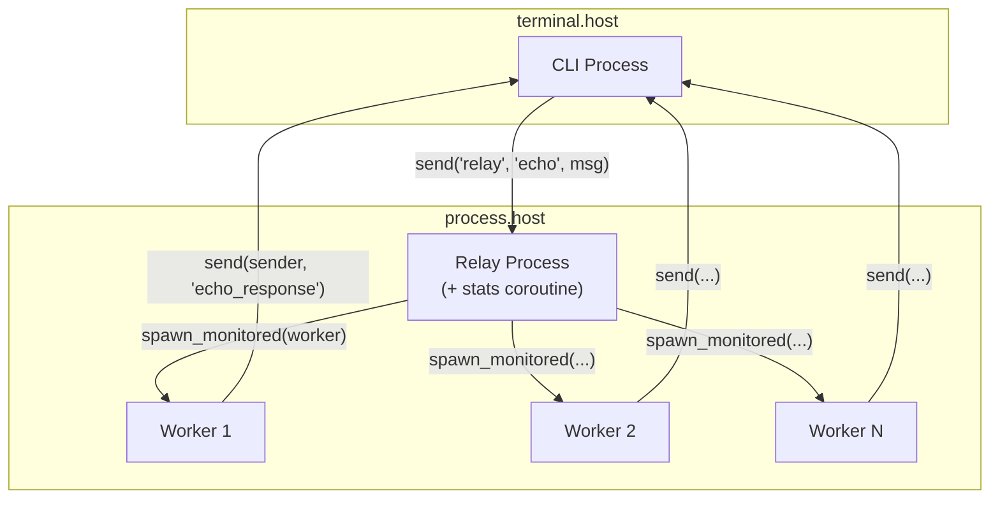

# Echo Service

构建一个分布式 echo 服务，演示进程、通道、协程、消息传递和监督。

## 概述

本教程创建一个 CLI 客户端，向 relay 服务发送消息，relay 为每条消息生成 worker 进行处理。演示内容包括：

- **进程生成** - 动态创建子进程
- **消息传递** - 通过 send/receive 在进程间通信
- **通道和 select** - 多路复用多个事件源
- **协程** - 进程内的并发执行
- **进程注册** - 按名称查找进程
- **监控** - 跟踪子进程生命周期

## 架构



## 项目结构

```
echo-service/
├── wippy.lock
└── src/
    ├── _index.yaml
    ├── cli.lua
    ├── relay.lua
    └── worker.lua
```

## 入口定义

创建 `src/_index.yaml`：

```yaml
version: "1.0"
namespace: app

entries:
  - name: terminal
    kind: terminal.host
    lifecycle:
      auto_start: true

  - name: processes
    kind: process.host
    lifecycle:
      auto_start: true

  - name: cli
    kind: process.lua
    source: file://cli.lua
    method: main
    modules:
      - io
      - process
      - time
      - channel

  - name: relay
    kind: process.lua
    source: file://relay.lua
    method: main
    modules:
      - process
      - logger
      - channel
      - time

  - name: relay-service
    kind: process.service
    process: app:relay
    host: app:processes
    lifecycle:
      auto_start: true

  - name: worker
    kind: process.lua
    source: file://worker.lua
    method: main
    modules:
      - process
      - time
```

## Relay 进程

relay 注册自身、处理消息、生成 worker，并运行一个 stats 协程。

创建 `src/relay.lua`：

```lua
local logger = require("logger")
local time = require("time")

local stats = {
    messages = 0,
    workers_spawned = 0
}

local function stats_reporter()
    while true do
        time.sleep("5s")
        logger:info("stats", {
            messages = stats.messages,
            workers_spawned = stats.workers_spawned
        })
    end
end

local function main()
    local inbox = process.inbox()
    local events = process.events()

    process.registry.register("relay")
    logger:info("relay started", {pid = process.pid()})

    coroutine.spawn(stats_reporter)

    while true do
        local r = channel.select {
            inbox:case_receive(),
            events:case_receive()
        }

        if r.channel == events then
            local event = r.value
            if event.kind == process.event.EXIT then
                logger:info("worker exited", {
                    from = event.from,
                    result = event.result
                })
            end
        else
            local msg = r.value
            if msg:topic() == "echo" then
                local echo = msg:payload():data()
                stats.messages = stats.messages + 1

                local worker_pid, err = process.spawn_monitored(
                    "app:worker",
                    "app:processes",
                    echo.sender,
                    echo.data
                )

                if err then
                    logger:error("spawn failed", {error = err})
                else
                    stats.workers_spawned = stats.workers_spawned + 1
                end
            end
        end
    end
end

return { main = main }
```

### 关键模式 {id="relay-key-patterns"}

**协程生成**

```lua
coroutine.spawn(stats_reporter)
```

创建一个与主函数共享内存的并发协程。协程在 I/O 操作（如 `time.sleep`）时让出。

**Channel Select**

```lua
local r = channel.select {
    inbox:case_receive(),
    events:case_receive()
}
```

等待多个通道。`r.channel` 标识触发的通道，`r.value` 包含数据。

**Payload 提取**

```lua
local echo = msg:payload():data()
```

消息有 `msg:topic()` 获取主题字符串，`msg:payload():data()` 获取负载。

**带监控的生成**

```lua
local worker_pid, err = process.spawn_monitored("app:worker", "app:processes", ...)
```

组合 spawn 和 monitor。当 worker 退出时，我们会收到 EXIT 事件。

## Worker 进程

Worker 直接接收参数并向发送者发送响应。

创建 `src/worker.lua`：

```lua
local time = require("time")

local function main(sender_pid, data)
    time.sleep("100ms")

    local response = {
        data = string.upper(data),
        worker = process.pid()
    }

    process.send(sender_pid, "echo_response", response)

    return 0
end

return { main = main }
```

## CLI 进程

CLI 通过注册名称发送消息，并带超时等待响应。

创建 `src/cli.lua`：

```lua
local io = require("io")
local time = require("time")

local reset = "\027[0m"
local function dim(s) return "\027[2m" .. s .. reset end
local function green(s) return "\027[32m" .. s .. reset end
local function yellow(s) return "\027[33m" .. s .. reset end
local function cyan(s) return "\027[36m" .. s .. reset end

local function main()
    local inbox = process.inbox()

    -- 等待 relay 注册
    time.sleep("200ms")

    io.print(cyan("Echo Client"))
    io.print(dim("Type messages to echo. Ctrl+C to exit.\n"))

    while true do
        io.write(yellow("> "))
        local input = io.readline()

        if not input or #input == 0 then
            break
        end

        local msg = {
            sender = process.pid(),
            data = input
        }
        local ok, err = process.send("relay", "echo", msg)
        if err then
            io.print(dim("  error: relay not available"))
        else
            local timeout = time.after("2s")
            local r = channel.select {
                inbox:case_receive(),
                timeout:case_receive()
            }

            if r.channel == timeout then
                io.print(dim("  timeout"))
            else
                local msg = r.value
                if msg:topic() == "echo_response" then
                    local resp = msg:payload():data()
                    io.print(green("  " .. resp.data))
                    io.print(dim("  from worker: " .. resp.worker))
                end
            end
        end
    end

    io.print("\nGoodbye!")
    return 0
end

return { main = main }
```

### 关键模式 {id="cli-key-patterns"}

**按名称发送**

```lua
process.send("relay", "echo", msg)
```

`process.send` 直接接受注册名称。如果未找到则返回错误。

**超时模式**

```lua
local timeout = time.after("2s")
local r = channel.select {
    inbox:case_receive(),
    timeout:case_receive()
}
if r.channel == timeout then
    -- 超时
end
```

## 运行

```bash
wippy init
wippy run -x app:terminal/app:cli
```

示例输出：

```
Echo Client
Type messages to echo. Ctrl+C to exit.

> hello world
  HELLO WORLD
  from worker: {app:processes|0x00004}
```

## 概念总结

| 概念 | API |
|---------|-----|
| 进程生成 | `process.spawn_monitored(entry, host, ...)` |
| 消息传递 | `process.send(dest, topic, data)` |
| 收件箱 | `process.inbox()` |
| 事件 | `process.events()` |
| 注册 | `process.registry.register(name)` |
| Channel select | `channel.select {...}` |
| 超时 | `time.after(duration)` |
| 协程 | `coroutine.spawn(fn)` |

## 下一步

- [Process Management](lua/core/process.md)
- [Channels](lua/core/channel.md)
- [Time and Duration](lua/core/time.md)
