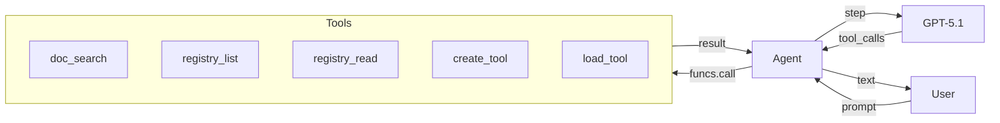
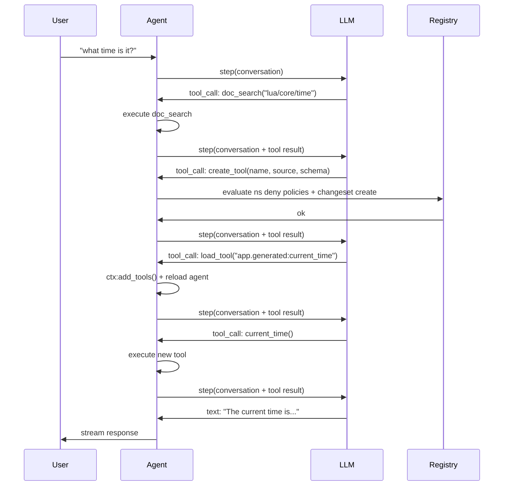
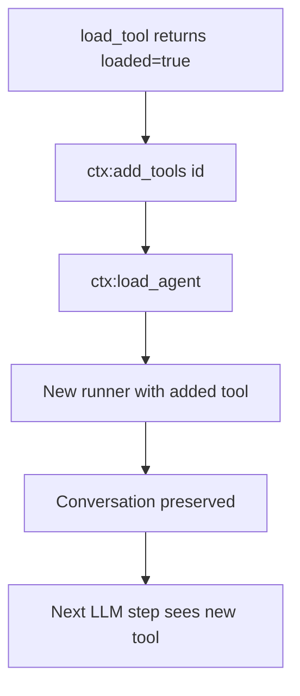
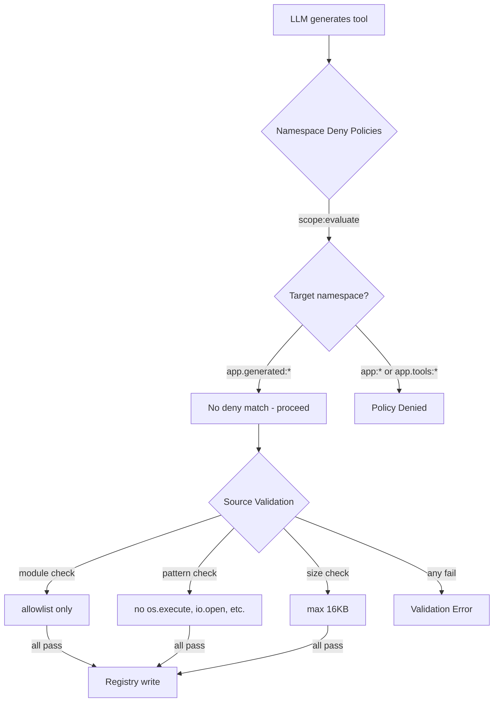

# Micro AGI

Build a self-modifying agent that creates its own tools at runtime — reading docs, writing Lua, registering entries in the registry, and loading them into the active session.

## What We're Building

A terminal agent that:
- Answers questions using an LLM with streaming
- Searches Wippy documentation to learn APIs
- Inspects the registry to discover existing capabilities
- Builds new tools on the fly when it lacks a capability
- Manages its own context window via compression



## Architecture

The agent runs as a Wippy process with access to the registry. When the LLM decides it needs a capability it doesn't have, it uses the self-modification loop:



The key insight: tools are registry entries. Creating a tool is just writing a `function.lua` entry with inline Lua source in `data.source`. The agent runtime compiles and loads it like any other entry.

## Project Structure

```
micro-agi/
├── .wippy.yaml
├── wippy.yaml
└── src/
    ├── _index.yaml
    ├── README.md
    ├── agent.lua
    └── tools/
        ├── _index.yaml
        ├── doc_search.lua
        ├── registry_list.lua
        ├── registry_read.lua
        ├── create_tool.lua
        └── load_tool.lua
```

## Infrastructure

Create `.wippy.yaml`:

```yaml
version: "1.0"

logger:
  mode: development
  level: info
  encoding: console
```

## Entry Definitions

Create `src/_index.yaml` with infrastructure, security policies, models, agent, and process:

```yaml
version: "1.0"
namespace: app

entries:
  - name: definition
    kind: ns.definition
    readme: file://README.md
    meta:
      title: Micro AGI
      description: Self-modifying development agent that builds its own tools at runtime
      depends_on: [wippy/llm, wippy/agent]

  - name: os_env
    kind: env.storage.os

  - name: processes
    kind: process.host
    lifecycle:
      auto_start: true

  - name: __dep.llm
    kind: ns.dependency
    component: wippy/llm
    version: "*"
    parameters:
      - name: env_storage
        value: app:os_env
      - name: process_host
        value: app:processes

  - name: __dep.agent
    kind: ns.dependency
    component: wippy/agent
    version: "*"
    parameters:
      - name: process_host
        value: app:processes
```

### Security Policies

Two `security.policy` entries use namespace-based deny to restrict where the agent can write:

```yaml
  # deny tool writes to core namespace
  - name: deny_core_ns
    kind: security.policy
    policy:
      actions: "*"
      resources: "app:*"
      effect: deny
    groups:
      - agent_security

  # deny tool writes to tools namespace
  - name: deny_tools_ns
    kind: security.policy
    policy:
      actions: "*"
      resources: "app.tools:*"
      effect: deny
    groups:
      - agent_security
```

These policies are loaded as a named scope (`app:agent_security`) by `create_tool` and evaluated before any registry write. The agent can write to `app.generated:*` (no deny policy matches), but cannot write to `app:*` (core entries, models, agent definition) or `app.tools:*` (built-in tools).

See [Security Model](../system/security.md) for details on policy evaluation.

### Models

Two models serve different purposes:

```yaml
  # reasoning model for the agent
  - name: gpt-5.1
    kind: registry.entry
    meta:
      name: gpt-5.1
      type: llm.model
      title: GPT-5.1
      comment: Reasoning model
      capabilities: [generate, tool_use, structured_output, vision, thinking]
      class: [reasoning]
      priority: 210
    max_tokens: 128000
    output_tokens: 32768
    pricing:
      input: 2.5
      output: 10
    providers:
      - id: wippy.llm.openai:provider
        options:
          reasoning_model_request: true
        provider_model: gpt-5.1
    thinking_effort: 10

  # cheap model for context compression
  - name: gpt-4.1-nano
    kind: registry.entry
    meta:
      name: gpt-4.1-nano
      type: llm.model
      title: GPT-4.1 Nano
      comment: Compression model
      capabilities: [generate, tool_use, structured_output]
      class: [fast]
      priority: 100
    max_tokens: 1047576
    output_tokens: 32768
    pricing:
      input: 0.1
      output: 0.4
    providers:
      - id: wippy.llm.openai:provider
        provider_model: gpt-4.1-nano
```

GPT-5.1 handles reasoning and tool use. GPT-4.1 Nano handles context compression at 25x lower cost.

### Agent Definition

```yaml
  - name: dev_assistant
    kind: registry.entry
    meta:
      type: agent.gen1
      name: dev_assistant
      title: Dev Assistant
      comment: Wippy development assistant
    prompt: |
      Self-modifying Wippy development agent. You run inside Wippy runtime
      with access to docs, registry, and dynamic tool creation.

      Rules:
      - NEVER fabricate, guess, or hallucinate facts. If you need real data,
        use or build a tool to get it. Only state what a tool actually returned.
      - Maximum 2-3 sentences per response. No bullet lists. No disclaimers.
      - Never say "I can't" or "I don't have". Build the tool and do it.
      - Act first, explain only if asked.

      To gain new capabilities: doc_search the API, create_tool with Lua source,
      load_tool, call it. All in one turn.
    model: gpt-5.1
    max_tokens: 2048
    tools:
      - "app.tools:*"
```

The prompt is deliberately terse. Key rules:
- **No hallucination** — the agent must use tools for real data
- **Self-modification** — build tools instead of refusing
- **Action over explanation** — do first, explain if asked

### Process

```yaml
  - name: agent
    kind: process.lua
    meta:
      command:
        name: agent
        short: Start dev assistant
    source: file://agent.lua
    method: main
    modules: [io, json, process, channel, funcs, registry, time, security]
    imports:
      prompt: wippy.llm:prompt
      agent_context: wippy.agent:context
      compress: wippy.llm.util:compress
```

The process runs as a terminal command (root level). Security enforcement happens inside the tools themselves — `create_tool` loads the `agent_security` policy group and evaluates it before writing.

Imports:
- `prompt` — conversation builder
- `agent_context` — agent loading and dynamic tool management
- `compress` — LLM-based text compression for context management

## Tools

Create `src/tools/_index.yaml` with five tools:

### doc_search

Fetches Wippy documentation via the `wippy.ai/llm` API. Supports two modes: fetch a page by path, or search by query.

```lua
local http_client = require("http_client")
local json = require("json")

local BASE_URL = "https://wippy.ai/llm"
local MAX_CHARS = 8000

local function fetch_page(path)
    local url = BASE_URL .. "/path/en/" .. path
    local resp, err = http_client.get(url, {
        headers = { ["User-Agent"] = "wippy-agent/1.0" },
    })
    if err then
        return nil, tostring(err)
    end
    if resp.status_code ~= 200 then
        return nil, "HTTP " .. resp.status_code
    end

    local body = resp.body or ""
    if #body > MAX_CHARS then
        body = body:sub(1, MAX_CHARS) .. "\n... (truncated)"
    end
    return body, nil
end

local function search_docs(query)
    local url = BASE_URL .. "/search?q=" .. query
    local resp, err = http_client.get(url, {
        headers = { ["User-Agent"] = "wippy-agent/1.0" },
    })
    if err then
        return { error = tostring(err) }
    end
    if resp.status_code ~= 200 then
        return { error = "HTTP " .. resp.status_code }
    end

    local body = resp.body or ""
    if #body > MAX_CHARS then
        body = body:sub(1, MAX_CHARS) .. "\n... (truncated)"
    end

    return { results = body }
end

local function handler(input)
    if input.path then
        local content, err = fetch_page(input.path)
        if err then
            return { error = err }
        end
        return { path = input.path, content = content }
    end

    if input.query then
        return search_docs(input.query)
    end

    return { error = "provide either 'path' or 'query'" }
end

return { handler = handler }
```

### create_tool

The core of self-modification. Validates input, evaluates namespace deny policies, and creates a `function.lua` entry in the registry with inline Lua source.

**Source validation** — code-level checks that policies cannot enforce:

```lua
local registry = require("registry")
local json = require("json")
local security = require("security")

local NAMESPACE = "app.generated"
local MAX_SOURCE_LEN = 16000
local MAX_NAME_LEN = 64

local ALLOWED_MODULES = {
    time = true, json = true, http_client = true, expr = true,
    text = true, base64 = true, yaml = true, crypto = true,
    hash = true, uuid = true, url = true,
}

local BLOCKED_PATTERNS = {
    "os%.execute", "os%.remove", "os%.rename",
    "io%.open", "io%.popen",
    "loadfile", "dofile",
    "debug%.", "package%.",
    "rawset", "rawget",
    "setfenv", "getfenv",
}
```

**Policy evaluation** — `create_tool` loads the `agent_security` named scope and evaluates the deny policies against the target entry ID. Writes to `app:*` or `app.tools:*` are denied; writes to `app.generated:*` pass (no matching deny policy):

```lua
local actor = security.new_actor("service:agent", { role = "agent" })
local scope, scope_err = security.named_scope("app:agent_security")
if scope_err then
    return { error = "failed to load security scope: " .. tostring(scope_err) }
end

local result = scope:evaluate(actor, action, id)
if result == "deny" then
    return { error = "policy denied: " .. action .. " on " .. id }
end
```

**Registry write** — the entry is written with source in `data.source`:

```lua
local entry = {
    id = id,
    kind = "function.lua",
    meta = {
        type = "tool",
        title = input.name,
        comment = input.description,
        input_schema = schema,
        llm_alias = input.name,
        llm_description = input.description,
    },
    data = {
        source = input.source,
        modules = modules,
        method = "handler",
    },
}

local snap = registry.snapshot()
local changes = snap:changes()
if existing then
    changes:update(entry)
else
    changes:create(entry)
end
changes:apply()
```

No files on disk. The tool lives entirely in the registry.

### load_tool

Validates the entry is a tool and signals the agent loop to reload:

```lua
local function handler(input)
    local entry, err = registry.get(input.id)
    if err then
        return { error = tostring(err) }
    end
    if not entry then
        return { error = "not found: " .. input.id }
    end
    if not entry.meta or entry.meta.type ~= "tool" then
        return { error = "not a tool (meta.type != 'tool'): " .. input.id }
    end

    return {
        loaded = true,
        id = entry.id,
        alias = entry.meta.llm_alias or input.id,
        description = entry.meta.llm_description or "",
    }
end
```

The agent loop detects `loaded = true` in the result and calls `ctx:add_tools(id)` followed by `ctx:load_agent()` to recompile the agent with the new tool.

## Agent Loop

The agent loop in `src/agent.lua` handles streaming, tool execution, dynamic loading, and context compression.

### Streaming

Uses the same coroutine + channel pattern from the [LLM Agent tutorial](llm-agent.md):

```lua
coroutine.spawn(function()
    local response, err = session.runner:step(session.conversation, {
        stream_target = {
            reply_to = process.pid(),
            topic = STREAM_TOPIC,
        },
    })
    done_ch:send({ response = response, err = err })
end)
```

### Tool Execution

Tools are called via `funcs.call()` with `pcall` for safety:

```lua
local ok, result = pcall(funcs.call, tc.registry_id, args)
```

### Dynamic Tool Loading

When `load_tool` returns `loaded = true`, the agent reloads itself:



```lua
local function handle_tool_loading(tool_calls, results)
    local reload_needed = false
    for _, tc in ipairs(tool_calls) do
        if tc.name == "load_tool" then
            local result = results[tc.id]
            if result and result.loaded then
                session.ctx:add_tools(result.id)
                reload_needed = true
            end
        end
    end
    if reload_needed then
        reload_agent()
    end
end
```

The conversation is preserved across reloads because it lives in the prompt builder, not in the runner.

### Context Compression

When prompt tokens exceed 96K (75% of the 128K context window), the conversation is compressed using GPT-4.1 Nano:

```lua
if response.tokens and response.tokens.prompt_tokens
    and response.tokens.prompt_tokens > PROMPT_TOKEN_LIMIT then
    try_compress()
end
```

Compression extracts message content, calls `compress.to_size()` targeting 4000 characters, and replaces the conversation with a summary:

```lua
local summary = compress.to_size(COMPRESS_MODEL, full_text, COMPRESS_TARGET)
session.conversation = prompt.new()
session.conversation:add_system("Conversation summary:\n\n" .. summary)
```

## Security Model

The agent is secured at two levels: declarative namespace deny policies and code-level source validation.



### Namespace Deny Policies

| Policy | Resources | Effect |
|--------|-----------|--------|
| `deny_core_ns` | `app:*` | deny |
| `deny_tools_ns` | `app.tools:*` | deny |

`create_tool` loads the `agent_security` policy group and evaluates against the target entry ID. Since deny policies only match `app:*` and `app.tools:*`, writes to `app.generated:*` pass through (result is `undefined`, meaning "not denied").

This prevents the agent from:
- Modifying its own prompt or agent definition (`app:dev_assistant`)
- Overwriting its built-in tools (`app.tools:*`)
- Changing infrastructure entries (`app:processes`, etc.)

Source validation additionally blocks `os.execute`, `io.open`, `debug.*`, `package.*`, and enforces a module allowlist and 16KB size limit.

## Run

Run directly from hub:

```bash
export OPENAI_API_KEY=sk-...
wippy run wippy/micro-agi agent
```

Or clone and run locally:

```bash
cd micro-agi
export OPENAI_API_KEY=sk-...
wippy init && wippy update
wippy run agent
```

```
dev assistant (quit to exit)

> what time is it?
  [doc_search] ok
  [create_tool] ok
  [load_tool] ok
  [+] app.generated:current_time_utc
  [current_time_utc] ok
The current UTC time is 2026-02-13T03:13:41Z.

> fetch https://httpbin.org/get and show my ip
  [create_tool] ok
  [load_tool] ok
  [+] app.generated:http_get
  [http_get] ok
Your IP is 98.24.33.45.
```

## Next Steps

- [LLM Agent](llm-agent.md) — Build a basic agent from scratch
- [Agent Module](../framework/agents.md) — Agent framework reference
- [Registry](../concepts/registry.md) — How the registry works
- [Security Model](../system/security.md) — Declarative security policies
- [Entry Kinds](../guides/entry-kinds.md) — Available entry types
