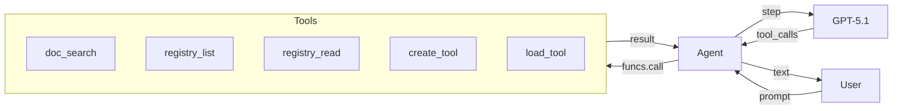
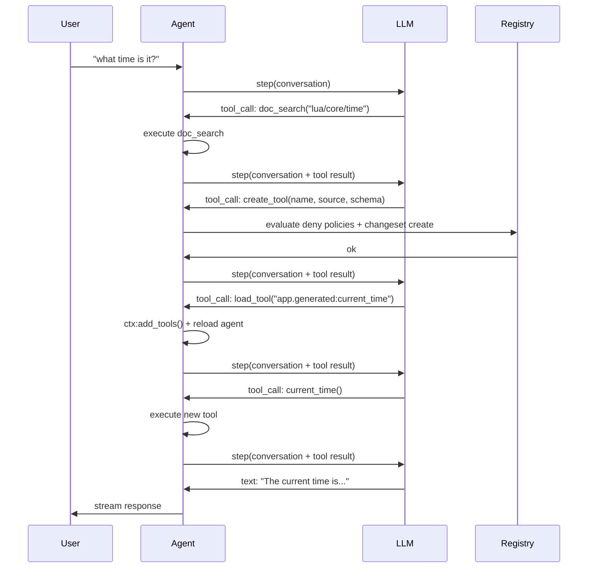
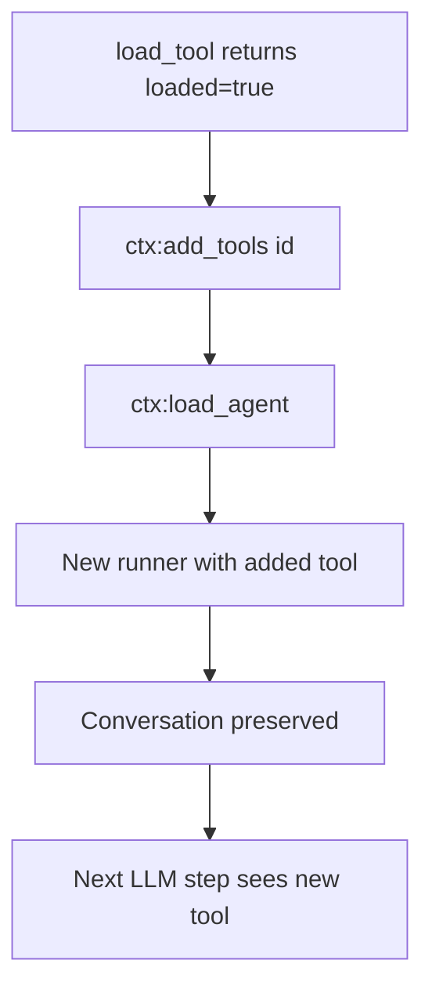
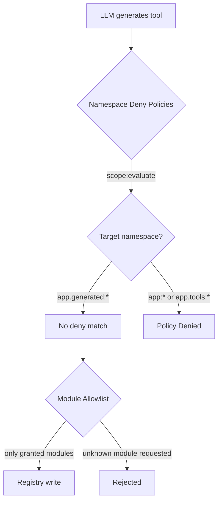

# Micro AGI

构建一个能够自我修改的智能体，它在运行时创建自己的工具——阅读文档、编写 Lua、在注册表中注册入口，并将它们加载到活动会话中。

## 我们要构建什么

一个终端智能体，它能：
- 使用具有流式输出的 LLM 回答问题
- 搜索 Wippy 文档以学习 API
- 检查注册表以发现现有能力
- 在缺乏某种能力时即时构建新工具
- 通过压缩管理自己的上下文窗口


```mermaid
flowchart LR
    User -->|prompt| Agent
    Agent -->|step| LLM[GPT-5.1]
    LLM -->|tool_calls| Agent
    Agent -->|funcs.call| Tools
    Tools -->|result| Agent
    Agent -->|text| User

    subgraph Tools
        doc_search
        registry_list
        registry_read
        create_tool
        load_tool
    end
```

## 架构

智能体作为可访问注册表的 Wippy 进程运行。当 LLM 决定它需要某个不具备的能力时，它使用自我修改循环：


```mermaid
sequenceDiagram
    participant U as User
    participant A as Agent
    participant L as LLM
    participant R as Registry

    U->>A: "what time is it?"
    A->>L: step(conversation)
    L->>A: tool_call: doc_search("lua/core/time")
    A->>A: execute doc_search
    A->>L: step(conversation + tool result)
    L->>A: tool_call: create_tool(name, source, schema)
    A->>R: evaluate deny policies + changeset create
    R->>A: ok
    A->>L: step(conversation + tool result)
    L->>A: tool_call: load_tool("app.generated:current_time")
    A->>A: ctx:add_tools() + reload agent
    A->>L: step(conversation + tool result)
    L->>A: tool_call: current_time()
    A->>A: execute new tool
    A->>L: step(conversation + tool result)
    L->>A: text: "The current time is..."
    A->>U: stream response
```

关键洞察：工具就是注册表入口。创建一个工具就是写入一个带有 `data.source` 内联 Lua 源码的 `function.lua` 入口。智能体运行时像编译加载任何其他入口一样编译并加载它。

## 项目结构

```
micro-agi/
├── .wippy.yaml
├── wippy.yaml
└── src/
    ├── _index.yaml
    ├── README.md
    ├── agent.lua
    └── tools/
        ├── _index.yaml
        ├── doc_search.lua
        ├── registry_list.lua
        ├── registry_read.lua
        ├── create_tool.lua
        └── load_tool.lua
```

## 基础设施

创建 `.wippy.yaml`：

```yaml
version: "1.0"

logger:
  encoding: console
```

## 入口定义

创建包含基础设施、安全策略、模型、智能体和进程的 `src/_index.yaml`：

```yaml
version: "1.0"
namespace: app

entries:
  - name: definition
    kind: ns.definition
    readme: file://README.md
    meta:
      title: Micro AGI
      description: Self-modifying development agent that builds its own tools at runtime
      depends_on: [wippy/llm, wippy/agent]

  - name: os_env
    kind: env.storage.os

  - name: processes
    kind: process.host
    lifecycle:
      auto_start: true

  - name: __dep.llm
    kind: ns.dependency
    component: wippy/llm
    version: "*"
    parameters:
      - name: env_storage
        value: app:os_env
      - name: process_host
        value: app:processes

  - name: __dep.agent
    kind: ns.dependency
    component: wippy/agent
    version: "*"
    parameters:
      - name: process_host
        value: app:processes
```

### 安全策略

两个 `security.policy` 入口限制智能体可以写入哪些命名空间：

```yaml
  - name: deny_core_ns
    kind: security.policy
    policy:
      actions: "*"
      resources: "app:*"
      effect: deny
    groups:
      - agent_security

  - name: deny_tools_ns
    kind: security.policy
    policy:
      actions: "*"
      resources: "app.tools:*"
      effect: deny
    groups:
      - agent_security
```

这些策略由 `create_tool` 作为命名作用域 (`app:agent_security`) 加载，并在任何注册表写入之前进行评估。智能体可以写入 `app.generated:*`（无匹配的拒绝策略），但不能写入 `app:*`（核心入口、模型、智能体定义）或 `app.tools:*`（内置工具）。

有关策略评估的详细信息，参见[安全模型](system/security.md)。

### 模型

两个模型用于不同目的：

```yaml
  - name: gpt-5.1
    kind: registry.entry
    meta:
      name: gpt-5.1
      type: llm.model
      title: GPT-5.1
      comment: Reasoning model
      capabilities: [generate, tool_use, structured_output, vision, thinking]
      class: [reasoning]
      priority: 210
    max_tokens: 128000
    output_tokens: 32768
    pricing:
      input: 2.5
      output: 10
    providers:
      - id: wippy.llm.openai:provider
        options:
          reasoning_model_request: true
        provider_model: gpt-5.1
    thinking_effort: 10

  - name: gpt-4.1-nano
    kind: registry.entry
    meta:
      name: gpt-4.1-nano
      type: llm.model
      title: GPT-4.1 Nano
      comment: Compression model
      capabilities: [generate, tool_use, structured_output]
      class: [fast]
      priority: 100
    max_tokens: 1047576
    output_tokens: 32768
    pricing:
      input: 0.1
      output: 0.4
    providers:
      - id: wippy.llm.openai:provider
        provider_model: gpt-4.1-nano
```

GPT-5.1 处理推理和工具使用。GPT-4.1 Nano 以低 25 倍的成本处理上下文压缩。

### 智能体定义

```yaml
  - name: dev_assistant
    kind: registry.entry
    meta:
      type: agent.gen1
      name: dev_assistant
      title: Dev Assistant
      comment: Wippy development assistant
    prompt: |
      Self-modifying Wippy development agent. You run inside Wippy runtime
      with access to docs, registry, and dynamic tool creation.

      Rules:
      - NEVER fabricate, guess, or hallucinate facts. If you need real data,
        use or build a tool to get it. Only state what a tool actually returned.
      - Maximum 2-3 sentences per response. No bullet lists. No disclaimers.
      - Never say "I can't" or "I don't have". Build the tool and do it.
      - Act first, explain only if asked.

      To gain new capabilities: doc_search the API, create_tool with Lua source,
      load_tool, call it. All in one turn.
    model: gpt-5.1
    max_tokens: 2048
    tools:
      - "app.tools:*"
```

提示词刻意保持简洁。关键规则：
- **不要幻觉** —— 智能体必须使用工具获取真实数据
- **自我修改** —— 构建工具而不是拒绝
- **行动优先于解释** —— 先执行，必要时再解释

### 进程

```yaml
  - name: agent
    kind: process.lua
    meta:
      command:
        name: agent
        short: Start dev assistant
    source: file://agent.lua
    method: main
    modules: [io, json, process, funcs, registry, time, security]
    imports:
      prompt: wippy.llm:prompt
      agent_context: wippy.agent:context
      compress: wippy.llm.util:compress
```

进程作为终端命令运行。安全强制在 `create_tool` 内部进行，它加载 `agent_security` 策略组并在写入前进行评估。

导入：
- `prompt` —— 对话构建器
- `agent_context` —— 智能体加载和动态工具管理
- `compress` —— 用于上下文管理的基于 LLM 的文本压缩

## 工具

创建包含五个工具的 `src/tools/_index.yaml`：

### doc_search

通过 `wippy.ai/llm` API 获取 Wippy 文档。支持两种模式：按路径获取页面，或按查询搜索。

```lua
local http_client = require("http_client")
local json = require("json")

local BASE_URL = "https://wippy.ai/llm"
local MAX_CHARS = 8000

local function fetch_page(path)
    local url = BASE_URL .. "/path/en/" .. path
    local resp, err = http_client.get(url, {
        headers = { ["User-Agent"] = "wippy-agent/1.0" },
    })
    if err then
        return nil, tostring(err)
    end
    if resp.status_code ~= 200 then
        return nil, "HTTP " .. resp.status_code
    end

    local body = resp.body or ""
    if #body > MAX_CHARS then
        body = body:sub(1, MAX_CHARS) .. "\n... (truncated)"
    end
    return body, nil
end

local function search_docs(query)
    local url = BASE_URL .. "/search?q=" .. query
    local resp, err = http_client.get(url, {
        headers = { ["User-Agent"] = "wippy-agent/1.0" },
    })
    if err then
        return { error = tostring(err) }
    end
    if resp.status_code ~= 200 then
        return { error = "HTTP " .. resp.status_code }
    end

    local body = resp.body or ""
    if #body > MAX_CHARS then
        body = body:sub(1, MAX_CHARS) .. "\n... (truncated)"
    end

    return { results = body }
end

local function handler(input)
    if input.path then
        local content, err = fetch_page(input.path)
        if err then
            return { error = err }
        end
        return { path = input.path, content = content }
    end

    if input.query then
        return search_docs(input.query)
    end

    return { error = "provide either 'path' or 'query'" }
end

return { handler = handler }
```

### create_tool

自我修改的核心。评估命名空间拒绝策略，并在注册表中创建带有内联 Lua 源代码的 `function.lua` 入口。

生成入口上的 `modules` 字段控制工具可以访问的内容。未列出的模块对该入口而言根本不存在 —— 没有什么需要阻止或扫描的。

```lua
local registry = require("registry")
local json = require("json")
local security = require("security")

local NAMESPACE = "app.generated"
local MAX_SOURCE_LEN = 16000
local MAX_NAME_LEN = 64

local ALLOWED_MODULES = {
    time = true, json = true, http_client = true, expr = true,
    text = true, base64 = true, yaml = true, crypto = true,
    hash = true, uuid = true, url = true,
}
```

**策略评估** —— `create_tool` 加载 `agent_security` 命名作用域，并对目标入口 ID 评估拒绝策略。对 `app:*` 或 `app.tools:*` 的写入被拒绝；对 `app.generated:*` 的写入通过（无匹配的拒绝策略）：

```lua
local actor = security.new_actor("service:agent", { role = "agent" })
local scope, scope_err = security.named_scope("app:agent_security")
if scope_err then
    return { error = "failed to load security scope: " .. tostring(scope_err) }
end

local result = scope:evaluate(actor, action, id)
if result == "deny" then
    return { error = "policy denied: " .. action .. " on " .. id }
end
```

**注册表写入** —— 入口在 `data.source` 中带有源代码并仅包含允许的模块：

```lua
local entry = {
    id = id,
    kind = "function.lua",
    meta = {
        type = "tool",
        title = input.name,
        comment = input.description,
        input_schema = schema,
        llm_alias = input.name,
        llm_description = input.description,
    },
    data = {
        source = input.source,
        modules = modules,
        method = "handler",
    },
}

local snap = registry.snapshot()
local changes = snap:changes()
if existing then
    changes:update(entry)
else
    changes:create(entry)
end
changes:apply()
```

磁盘上没有文件。工具完全存在于注册表中。

### load_tool

验证入口是工具并向智能体循环发送重新加载信号：

```lua
local function handler(input)
    local entry, err = registry.get(input.id)
    if err then
        return { error = tostring(err) }
    end
    if not entry then
        return { error = "not found: " .. input.id }
    end
    if not entry.meta or entry.meta.type ~= "tool" then
        return { error = "not a tool (meta.type != 'tool'): " .. input.id }
    end

    return {
        loaded = true,
        id = entry.id,
        alias = entry.meta.llm_alias or input.id,
        description = entry.meta.llm_description or "",
    }
end
```

智能体循环检测到结果中的 `loaded = true`，并调用 `ctx:add_tools(id)`，然后调用 `ctx:load_agent()` 以使用新工具重新编译智能体。

## 智能体循环

`src/agent.lua` 中的智能体循环处理流式输出、工具执行、动态加载和上下文压缩。

### 流式输出

使用与 [LLM Agent 教程](tutorials/llm-agent.md) 相同的协程 + 通道模式：

```lua
coroutine.spawn(function()
    local response, err = session.runner:step(session.conversation, {
        stream_target = {
            reply_to = process.pid(),
            topic = STREAM_TOPIC,
        },
    })
    done_ch:send({ response = response, err = err })
end)
```

### 工具执行

工具通过 `funcs.call()` 调用，并使用 `pcall` 保证安全：

```lua
local ok, result = pcall(funcs.call, tc.registry_id, args)
```

### 动态工具加载

当 `load_tool` 返回 `loaded = true` 时，智能体重新加载自身：


```mermaid
flowchart TD
    A[load_tool returns loaded=true] --> B[ctx:add_tools id]
    B --> C[ctx:load_agent]
    C --> D[New runner with added tool]
    D --> E[Conversation preserved]
    E --> F[Next LLM step sees new tool]
```

```lua
local function handle_tool_loading(tool_calls, results)
    local reload_needed = false
    for _, tc in ipairs(tool_calls) do
        if tc.name == "load_tool" then
            local result = results[tc.id]
            if result and result.loaded then
                session.ctx:add_tools(result.id)
                reload_needed = true
            end
        end
    end
    if reload_needed then
        reload_agent()
    end
end
```

对话在重新加载过程中得以保留，因为它存在于提示构建器中，而不是运行器中。

### 上下文压缩

当提示词 token 超过 96K（128K 上下文窗口的 75%）时，使用 GPT-4.1 Nano 压缩对话：

```lua
if response.tokens and response.tokens.prompt_tokens
    and response.tokens.prompt_tokens > PROMPT_TOKEN_LIMIT then
    try_compress()
end
```

压缩提取消息内容，调用 `compress.to_size()` 目标为 4000 字符，并用摘要替换对话：

```lua
local summary = compress.to_size(COMPRESS_MODEL, full_text, COMPRESS_TARGET)
session.conversation = prompt.new()
session.conversation:add_system("Conversation summary:\n\n" .. summary)
```

## 安全模型

智能体通过命名空间拒绝策略和模块级访问控制得到保护。


```mermaid
flowchart TD
    LLM[LLM generates tool] --> P{Namespace Deny Policies}
    P -->|scope:evaluate| Check{Target namespace?}
    Check -->|app.generated:*| OK[No deny match]
    Check -->|app:* or app.tools:*| Deny[Policy Denied]

    OK --> M{Module Allowlist}
    M -->|only granted modules| R[Registry write]
    M -->|unknown module requested| Err[Rejected]
```

### 命名空间拒绝策略

| 策略 | 资源 | 效果 |
|--------|-----------|--------|
| `deny_core_ns` | `app:*` | deny |
| `deny_tools_ns` | `app.tools:*` | deny |

`create_tool` 加载 `agent_security` 策略组并对目标入口 ID 进行评估。由于拒绝策略仅匹配 `app:*` 和 `app.tools:*`，对 `app.generated:*` 的写入会通过（结果为 `undefined`，意为"未拒绝"）。

这阻止了智能体：
- 修改自己的提示词或智能体定义（`app:dev_assistant`）
- 覆盖其内置工具（`app.tools:*`）
- 更改基础设施入口（`app:processes` 等）

### 模块访问控制

生成的工具在 `data.modules` 中声明它们的 `modules`。仅允许来自 `ALLOWED_MODULES` 集合的模块。Wippy 运行时在模块层级强制执行此约束 —— 如果某个模块未列在入口上，`require()` 将返回错误。无需源代码扫描，因为没有什么需要扫描的：未授予的模块在执行上下文中根本不存在。

## 运行

直接从 hub 运行：

```bash
wippy run wippy/micro-agi agent
```

或克隆并在本地运行：

```bash
cd micro-agi
wippy init && wippy update
wippy run agent
```

```
dev assistant (quit to exit)

> what time is it?
  [doc_search] ok
  [create_tool] ok
  [load_tool] ok
  [+] app.generated:current_time_utc
  [current_time_utc] ok
The current UTC time is 2026-02-13T03:13:41Z.

> fetch https://httpbin.org/get and show my ip
  [create_tool] ok
  [load_tool] ok
  [+] app.generated:http_get
  [http_get] ok
Your IP is 203.0.113.42.
```

## 下一步

- [LLM Agent](tutorials/llm-agent.md) —— 从零构建一个基本的智能体
- [Agent 模块](framework/agents.md) —— Agent 框架参考
- [注册表](concepts/registry.md) —— 注册表的工作原理
- [安全模型](system/security.md) —— 声明式安全策略
- [入口类型](guides/entry-kinds.md) —— 可用的入口类型
