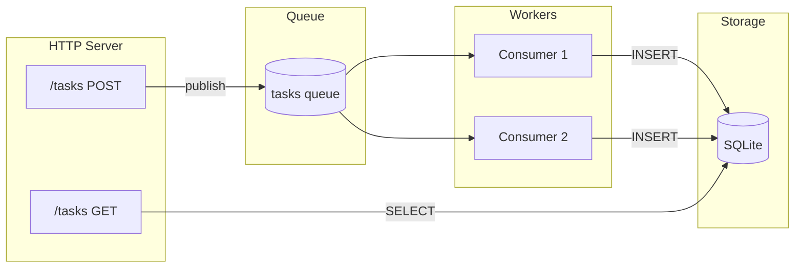

# Task Queue

构建一个 REST API，将任务排队进行后台处理，并使用数据库持久化。

## 概述

本教程创建一个任务管理 API，演示：

- **REST 端点** - POST 任务，GET 结果
- **队列发布** - 异步作业分发
- **队列消费者** - 后台 worker
- **数据库持久化** - SQLite 存储
- **迁移** - 执行一次后退出的进程



## 项目结构

```
task-queue/
├── wippy.lock
└── src/
    ├── _index.yaml
    ├── migrate.lua
    ├── create_task.lua
    ├── list_tasks.lua
    └── process_task.lua
```

## 入口定义

创建 `src/_index.yaml`：

```yaml
version: "1.0"
namespace: app

entries:
  # SQLite 数据库
  - name: db
    kind: db.sql.sqlite
    file: "./data/tasks.db"
    lifecycle:
      auto_start: true

  # 内存队列驱动
  - name: queue_driver
    kind: queue.driver.memory
    lifecycle:
      auto_start: true

  # 任务队列
  - name: tasks_queue
    kind: queue.queue
    driver: app:queue_driver

  # HTTP 服务器
  - name: gateway
    kind: http.service
    addr: ":8080"
    lifecycle:
      auto_start: true

  # 路由器
  - name: router
    kind: http.router
    meta:
      server: app:gateway

  # 迁移进程（运行一次后退出）
  - name: migrate
    kind: process.lua
    source: file://migrate.lua
    method: main
    modules:
      - sql
      - logger

  # 迁移服务（自动启动，成功后退出）
  - name: migrate-service
    kind: process.service
    process: app:migrate
    host: app:processes
    lifecycle:
      auto_start: true

  # 进程宿主
  - name: processes
    kind: process.host
    lifecycle:
      auto_start: true

  # API 处理程序
  - name: create_task
    kind: function.lua
    source: file://create_task.lua
    method: handler
    modules:
      - http
      - queue
      - uuid

  - name: list_tasks
    kind: function.lua
    source: file://list_tasks.lua
    method: handler
    modules:
      - http
      - sql

  # 队列 worker
  - name: process_task
    kind: function.lua
    source: file://process_task.lua
    method: main
    modules:
      - queue
      - sql
      - logger
      - time
      - json

  # 端点
  - name: create_task.endpoint
    kind: http.endpoint
    meta:
      router: app:router
    method: POST
    path: /tasks
    func: app:create_task

  - name: list_tasks.endpoint
    kind: http.endpoint
    meta:
      router: app:router
    method: GET
    path: /tasks
    func: app:list_tasks

  # 队列消费者
  - name: task_consumer
    kind: queue.consumer
    queue: app:tasks_queue
    func: app:process_task
    concurrency: 2
    prefetch: 5
    lifecycle:
      auto_start: true
```

## 迁移进程

创建 `src/migrate.lua`：

```lua
local sql = require("sql")
local logger = require("logger")

local function main()
    local db, err = sql.get("app:db")
    if err then
        logger:error("failed to connect", {error = tostring(err)})
        return 1
    end

    local _, exec_err = db:execute([[
        CREATE TABLE IF NOT EXISTS tasks (
            id TEXT PRIMARY KEY,
            payload TEXT NOT NULL,
            status TEXT NOT NULL DEFAULT 'pending',
            result TEXT,
            created_at INTEGER NOT NULL,
            processed_at INTEGER
        )
    ]])

    db:release()

    if exec_err then
        logger:error("migration failed", {error = tostring(exec_err)})
        return 1
    end

    logger:info("migration complete")
    return 0
end

return { main = main }
```

<tip>
返回 0 表示成功。supervisor 不会重启正常退出（退出码 0）的进程。
</tip>

## 创建任务端点

创建 `src/create_task.lua`：

```lua
local http = require("http")
local queue = require("queue")
local uuid = require("uuid")

local function handler()
    local req, req_err = http.request()
    local res, res_err = http.response()

    if not req or not res then
        return nil, "failed to get HTTP context"
    end

    local body, parse_err = req:body_json()
    if parse_err then
        res:set_status(http.STATUS.BAD_REQUEST)
        res:write_json({error = "invalid JSON"})
        return
    end

    if not body.action then
        res:set_status(http.STATUS.BAD_REQUEST)
        res:write_json({error = "action required"})
        return
    end

    local task_id = uuid.v4()
    local task = {
        id = task_id,
        action = body.action,
        data = body.data or {},
        created_at = os.time()
    }

    local ok, err = queue.publish("app:tasks_queue", task)
    if err then
        res:set_status(http.STATUS.INTERNAL_SERVER_ERROR)
        res:write_json({error = "failed to queue task"})
        return
    end

    res:set_status(http.STATUS.ACCEPTED)
    res:write_json({
        id = task_id,
        status = "queued"
    })
end

return { handler = handler }
```

## 列出任务端点

创建 `src/list_tasks.lua`：

```lua
local http = require("http")
local sql = require("sql")

local function handler()
    local req, req_err = http.request()
    local res, res_err = http.response()

    if not req or not res then
        return nil, "failed to get HTTP context"
    end

    local db, db_err = sql.get("app:db")
    if db_err then
        res:set_status(http.STATUS.INTERNAL_SERVER_ERROR)
        res:write_json({error = "database unavailable"})
        return
    end

    local status_filter = req:query("status")

    local query = sql.builder.select("id", "payload", "status", "result", "created_at", "processed_at")
        :from("tasks")
        :order_by("created_at DESC")
        :limit(100)

    if status_filter then
        query = query:where({status = status_filter})
    end

    local rows, query_err = query:run_with(db):query()
    db:release()

    if query_err then
        res:set_status(http.STATUS.INTERNAL_SERVER_ERROR)
        res:write_json({error = "query failed"})
        return
    end

    res:set_status(http.STATUS.OK)
    res:write_json({
        tasks = rows,
        count = #rows
    })
end

return { handler = handler }
```

## 队列 Worker

创建 `src/process_task.lua`：

```lua
local queue = require("queue")
local sql = require("sql")
local logger = require("logger")
local time = require("time")
local json = require("json")

local function main(task)
    local msg, msg_err = queue.message()
    if msg_err then
        logger:error("failed to get message", {error = tostring(msg_err)})
        return false
    end

    logger:info("processing task", {
        id = task.id,
        action = task.action
    })

    -- 模拟工作
    time.sleep("100ms")

    -- 根据 action 处理
    local result
    if task.action == "uppercase" then
        result = {output = string.upper(task.data.text or "")}
    elseif task.action == "sum" then
        local nums = task.data.numbers or {}
        local total = 0
        for _, n in ipairs(nums) do
            total = total + n
        end
        result = {output = total}
    else
        result = {output = "processed"}
    end

    -- 存储到数据库
    local db, db_err = sql.get("app:db")
    if db_err then
        logger:error("database unavailable", {error = tostring(db_err)})
        return false
    end

    local insert = sql.builder.insert("tasks")
        :columns("id", "payload", "status", "result", "created_at", "processed_at")
        :values(
            task.id,
            json.encode(task),
            "completed",
            json.encode(result),
            task.created_at,
            os.time()
        )

    local _, exec_err = insert:run_with(db):exec()
    db:release()

    if exec_err then
        logger:error("failed to store result", {error = tostring(exec_err)})
        return false
    end

    logger:info("task completed", {id = task.id})
    return true
end

return { main = main }
```

<note>
返回 `true` 确认消息。返回 `false` 导致消息重新入队或发送到死信队列。
</note>

## 运行服务

初始化并运行：

```bash
mkdir -p data
wippy init
wippy run
```

测试 API：

```bash
# 创建任务
curl -X POST http://localhost:8080/tasks \
  -H "Content-Type: application/json" \
  -d '{"action": "uppercase", "data": {"text": "hello world"}}'

# 响应: {"id": "550e8400-...", "status": "queued"}

# 等待处理完成，然后列出任务
curl http://localhost:8080/tasks

# 响应: {"tasks": [...], "count": 1}

# 按状态过滤
curl "http://localhost:8080/tasks?status=completed"
```

## 消息流程

1. **POST /tasks** 接收请求，生成 UUID，发布到队列
2. **队列消费者** 获取消息（2 个并发 worker）
3. **Worker** 处理任务，将结果写入 SQLite
4. **GET /tasks** 从数据库读取已完成的任务

## 演示的概念

| 概念 | API | 描述 |
|---------|-----|-------------|
| REST 端点 | `http.request()`, `http.response()` | 处理 HTTP 请求 |
| 队列发布 | `queue.publish(id, data)` | 发送异步作业 |
| 队列消费 | `queue.message()` | 在处理程序中访问消息 |
| 数据库查询 | `sql.get()`, `db:query()` | 读取数据 |
| 查询构建器 | `sql.builder.insert()` | 安全构建 SQL |
| 迁移 | 返回 0 的进程 | 一次性设置任务 |
| 并发 | `concurrency: 2` | 并行 worker |

## 下一步

- [HTTP Module](lua/http/http.md) - 请求/响应处理
- [Queue Module](lua/storage/queue.md) - 消息队列操作
- [SQL Module](lua/storage/sql.md) - 数据库访问
- [Queue Consumers](guides/queue-consumers.md) - 队列配置
